# FibCalc Rafał Baliński

Projekt fibcalc jest zmodyfikowaną wersją aplikacji z
zajęc laboratoryjnych "Programowanie Full Stack w
Chumrze Obliczeniowej". Zmianie uległa część Frontendowa (kliencka)
aplikacji. Została ona napisana od postaw w Angularze w wersji 14.2.10.

Aplikacja będzie dostępna po tym [linkiem](http://rbmultifib-env.eba-ntaaqh2z.us-east-1.elasticbeanstalk.com/calculator)
do dnia 29.01.2023. Potem zostanie usunięta

Obrazy aplikacji dostępne są na platformie docker hub pod tym [linkiem](https://hub.docker.com/r/rafalbalinski/fullstack). Można je także pobrać wykonując komendę  
`docker pull rafalbalinski/fullstack`

## Zrzuty ekranowe aplikacji
Ponieżej przedstawiony jest widok kalkulatora
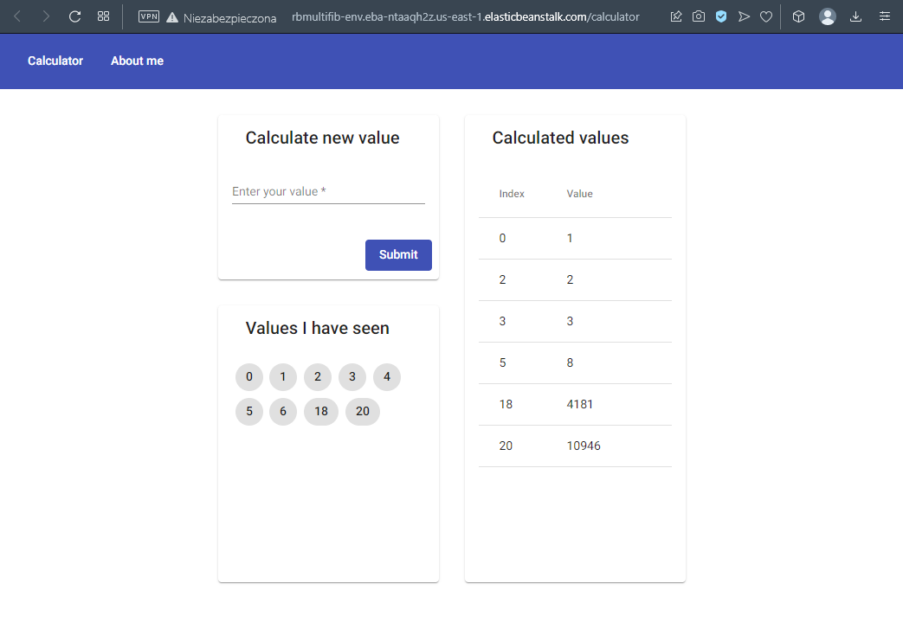

Drugi screen przedstawia widok z danymi autora
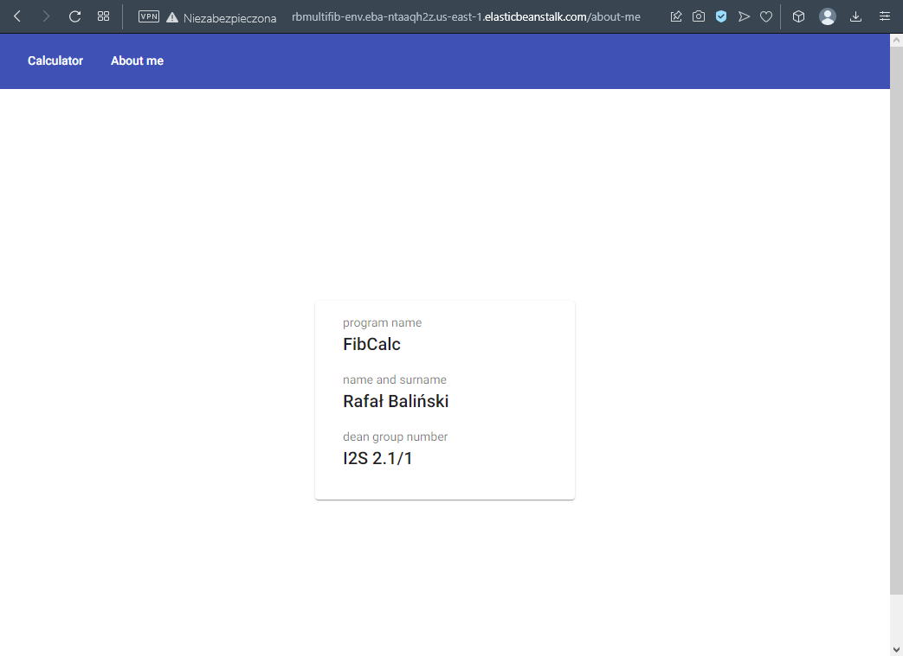

## Tworzenie bazy danych PostgreSQL za pomocą usługi RDS
Poniższy screen prezentuje zastosowane ustawienia przy tworzeniu bazy danych PostgreSQL
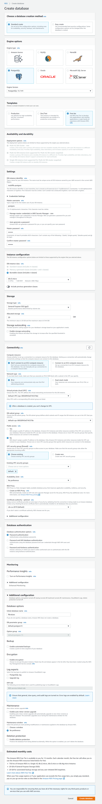

Jak widać instancja bazy została poprawnie utworzona oraz działa, co wskazuje status **Available**
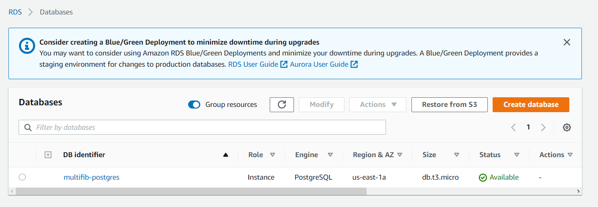

## Tworzenie bazy danych Redis za pomocą usługi ElastiCache
Poniższy screeny prezentują zastosowane ustawienia przy tworzeniu bazy danych Redis
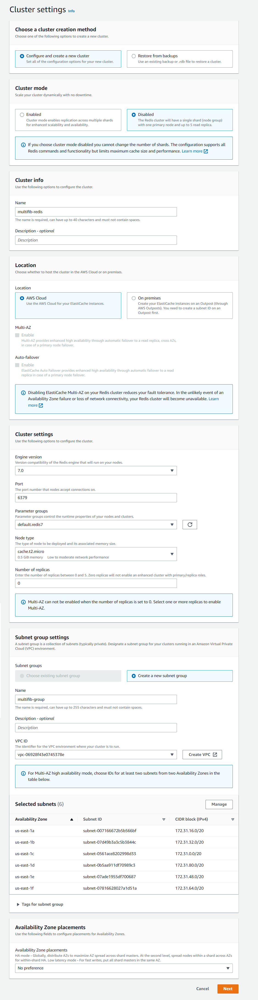
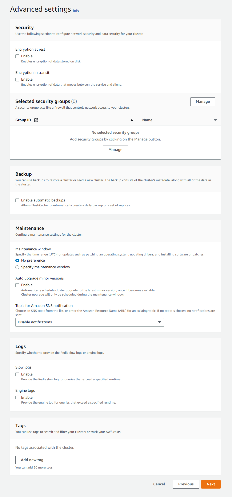
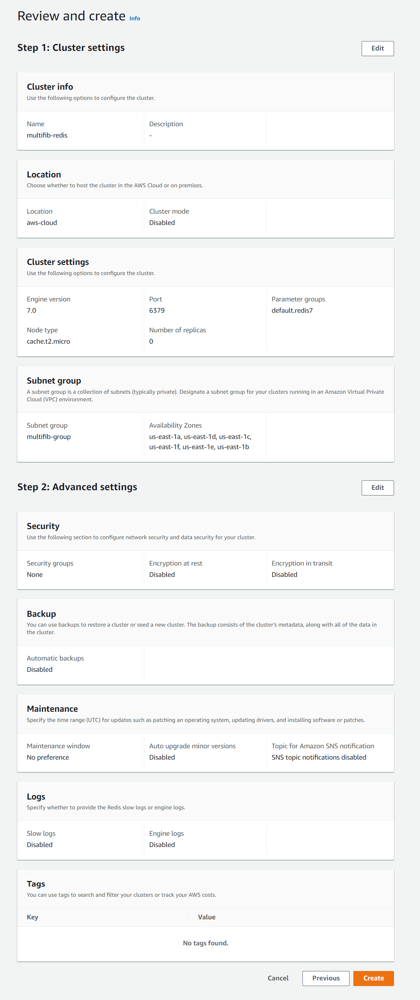

Jak widać instancja bazy została poprawnie utworzona oraz działa, co wskazuje status **Available**

## Tworzenie grupy bezpieczeństwa
Aby serwery mogłby się komunikować z bazami **postgreSQL** oraz **Redis**
należy utworzyć grupę bezpieczeństwa w której zdefiniowane zostanie
na jakich portach serwisy mogą się między sobą komunikować  
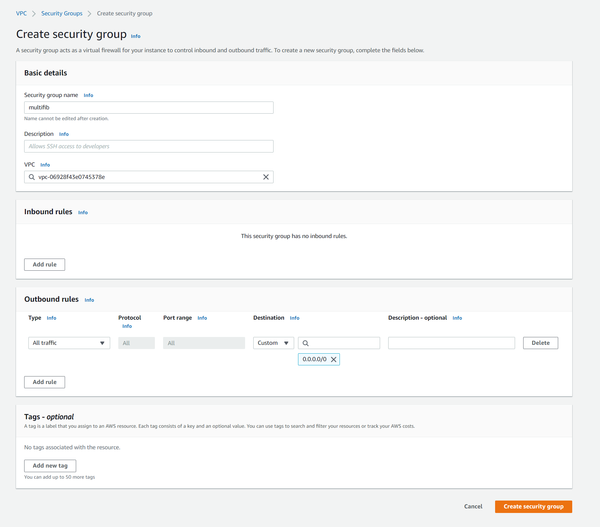
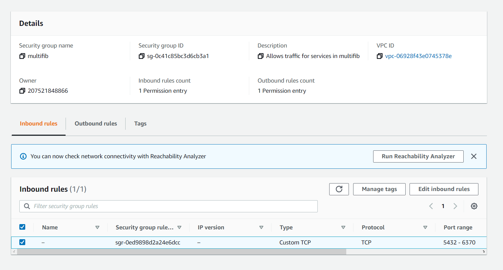

Następnie utworzoną grupe należy dodać do wszystkich trzech usług
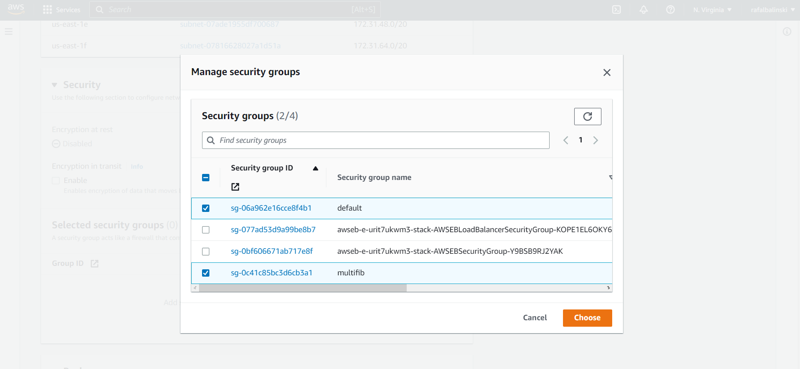
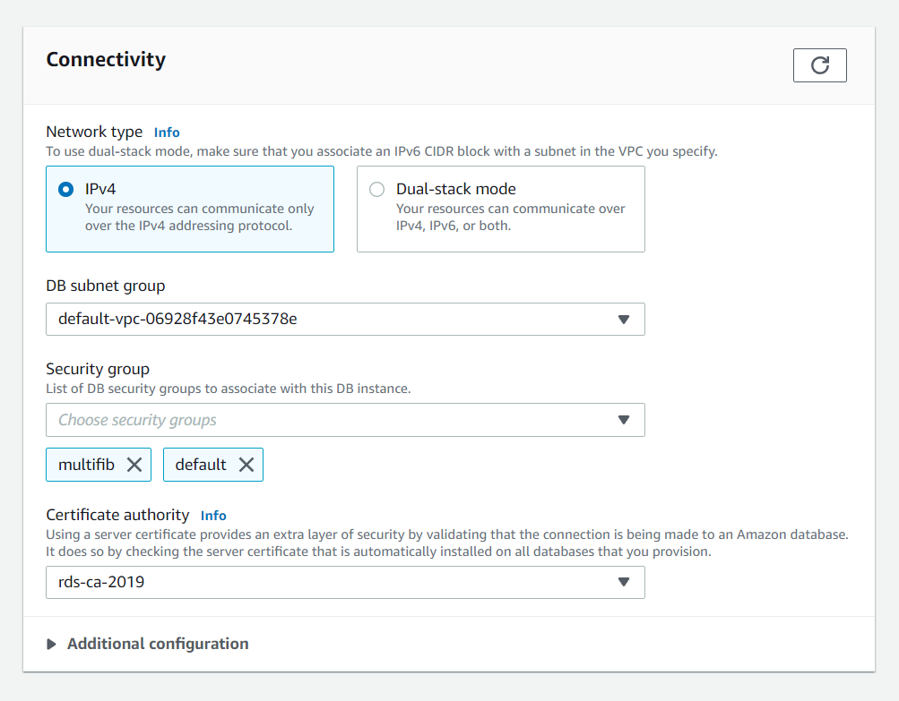
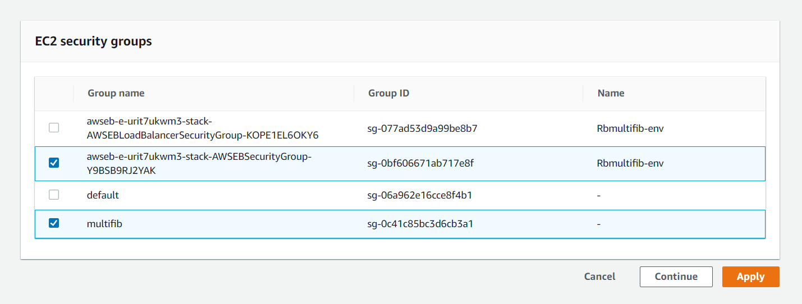

## Tworzenie usługi Elastic Beanstalk
Po uprzednim utworzeniu środowiska w usłudzie Elastic Beanstalk, należy je skonfigurować
dodając zmienne używane w kodzie aplikacji. Konfigurację tych zmiennych
ilustruje poniższy screen:
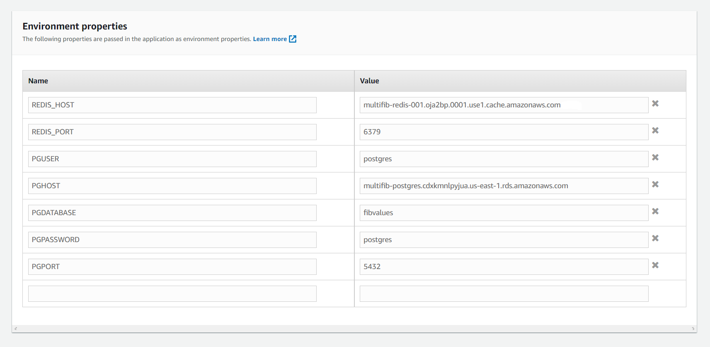

