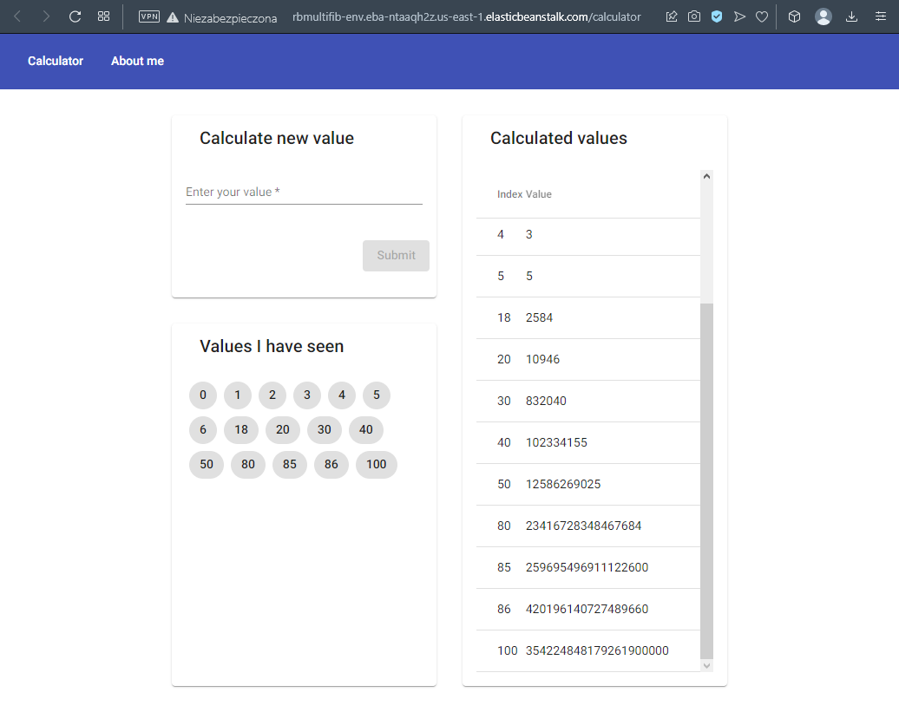

[**Strona główna**](https://github.com/rafalbalinski/Multifib) |
[Redis](https://github.com/rafalbalinski/Multifib/blob/master/README_REDIS.md) |
[PostgreSQL](https://github.com/rafalbalinski/Multifib/blob/master/README_POSTGRESQL.md) |
[Grupy bezpieczeństwa](https://github.com/rafalbalinski/Multifib/blob/master/README_SECURITY_GROUP.md)

# FibCalc Rafał Baliński

Projekt fibcalc jest zmodyfikowaną wersją aplikacji z
zajęc laboratoryjnych "Programowanie Full Stack w
Chumrze Obliczeniowej".

### zmiany 
Zmianie uległa część Frontendowa (kliencka)
aplikacji. Została ona napisana od postaw w Angularze w wersji 14.2.10.

Zoptymalizowany został także worker aplikacji. 
Zaimplementowany został nowy algorytm do obliczania n-tego wyrazu ciągu
oparty na macierzy Fibonacciego. Jest on znacznie szybszy niż rekurencja ogonowa i tradycyjna rekurencja. Algorytm ten opiera się na właściwości macierzy Fibonacciego, która ma postać:

```
|F(n+1) F(n) | = |1 1|^n * |F(1) F(0)|
|F(n)   F(n-1)|   |1 0|    |F(0) F(-1)|
```

Implementacja algorytmu widoczna jest poniżej:

```
function matrixPower(matrix, n) {
  if (n === 1) return matrix;
  let result = matrixPower(matrix, Math.floor(n / 2));
  result = multiplyMatrix(result, result);
  if (n % 2 === 1) {
    result = multiplyMatrix(result, matrix);
  }
  return result;
}

function multiplyMatrix(a, b) {
  let c = [[0, 0], [0, 0]];
  c[0][0] = a[0][0] * b[0][0] + a[0][1] * b[1][0];
  c[0][1] = a[0][0] * b[0][1] + a[0][1] * b[1][1];
  c[1][0] = a[1][0] * b[0][0] + a[1][1] * b[1][0];
  c[1][1] = a[1][0] * b[0][1] + a[1][1] * b[1][1];
  return c;
}

function fib(n) {
  if (n === 0) {
    return 0;
  }
  let matrix = [[1, 1], [1, 0]];
  matrix = matrixPower(matrix, n - 1);
  return matrix[0][0];
}
```
Po implementacji algorytmu macierzowego zwiększono maksymalny obliczalny indeks ciągu z 40 do 150.

### dostępność aplikacji
Aplikacja będzie dostępna po tym [linkiem](http://rbmultifib-env.eba-ntaaqh2z.us-east-1.elasticbeanstalk.com/calculator)
do dnia 29.01.2023, po tym terminie zostanie usunięta.

Obrazy aplikacji dostępne są na platformie docker hub pod tym [linkiem](https://hub.docker.com/r/rafalbalinski/fullstack). Można je także pobrać wykonując komendę <br>
`docker pull rafalbalinski/fullstack`

## Zrzuty ekranowe aplikacji
Ponieżej przedstawiony jest widok kalkulatora


Drugi screen przedstawia widok z danymi autora


## Tworzenie usługi Elastic Beanstalk
Po uprzednim utworzeniu środowiska w usłudzie Elastic Beanstalk, należy je skonfigurować
dodając zmienne używane w kodzie aplikacji. Konfigurację tych zmiennych
ilustruje poniższy screen:


<a href=https://github.com/rafalbalinski/Multifib/blob/master/README_POSTGRESQL.md>
    <h2>Tworzenie bazy danych PostgreSQL za pomocą usługi RDS</h2> 
</a>

<a href=https://github.com/rafalbalinski/Multifib/blob/master/README_REDIS.md>
    <h2>Tworzenie bazy danych Redis za pomocą usługi ElastiCache</h2> 
</a>

<a href=https://github.com/rafalbalinski/Multifib/blob/master/README_SECURITY_GROUP.md>
    <h2>Tworzenie grupy bezpieczeństwa</h2> 
</a>

