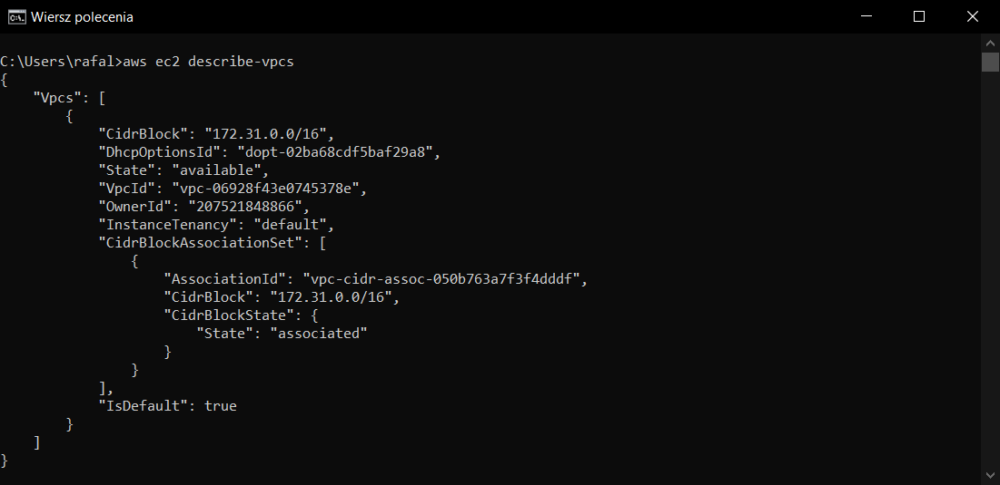

[Strona główna](https://github.com/rafalbalinski/Multifib) |
[Redis](https://github.com/rafalbalinski/Multifib/blob/master/README_REDIS.md) |
[PostgreSQL](https://github.com/rafalbalinski/Multifib/blob/master/README_POSTGRESQL.md) |
[Grupy bezpieczeństwa](https://github.com/rafalbalinski/Multifib/blob/master/README_SECURITY_GROUP.md)|
[**AWS CLI**](https://github.com/rafalbalinski/Multifib/blob/master/README_AWS_CLI.md)

# AWS CLI

## KONFIGURACJA
Konfiguracja AWS CLI


## DANE O KONFIGURACJI ŚRODOWISKA
Wynik działania polecenia
```
aws elasticbeanstalk describe-environments --environment-names Rbmultifib-env --output json
```
widoczny jest na poniższym screenie


## DODATKOWE POLECENIA
### aws rds describe-db-instances
```
aws rds describe-db-instances
```
Polecenie to jest używane do wyświetlenia szczegółowych informacji 
o instancjach bazy danych. Informacje te obejmują identyfikator instancji, typ bazy danych, 
status, adres IP, informacje o partycjach, konfigurację zasobów, metadane i inne. 


### aws ec2 describe-vpcs
```
aws ec2 describe-vpcs
```
Polecenie to  jest używane do wyświetlenia szczegółowych informacji o wirtualnych sieciach prywatnych (VPC)
