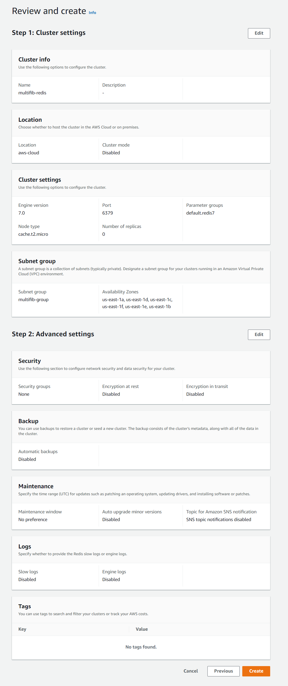
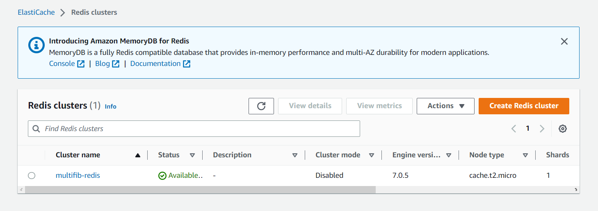

[Strona główna](https://github.com/rafalbalinski/Multifib) |
[**Redis**](https://github.com/rafalbalinski/Multifib/blob/master/README_REDIS.md) |
[PostgreSQL](https://github.com/rafalbalinski/Multifib/blob/master/README_POSTGRESQL.md) |
[Grupy bezpieczeństwa](https://github.com/rafalbalinski/Multifib/blob/master/README_SECURITY_GROUP.md)

# REDIS

## Tworzenie bazy danych Redis za pomocą usługi ElastiCache
Poniższy screeny prezentują zastosowane ustawienia przy tworzeniu bazy danych Redis

Jak widać instancja bazy została poprawnie utworzona oraz działa, co wskazuje status **Available**

