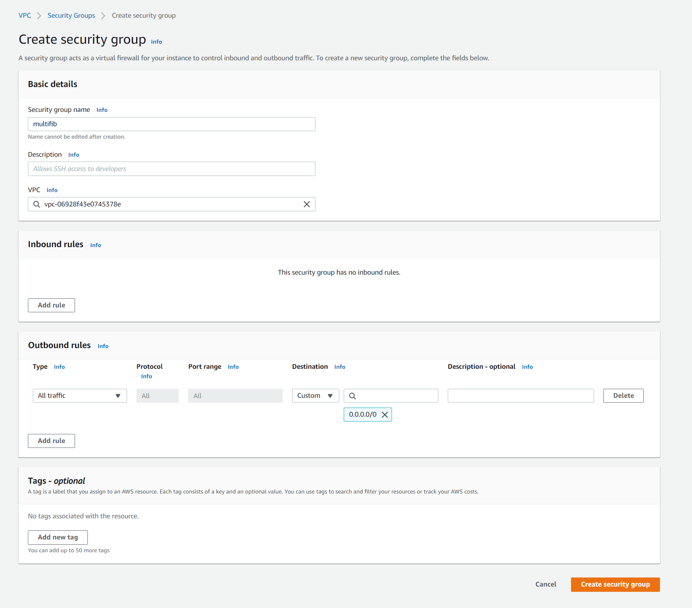
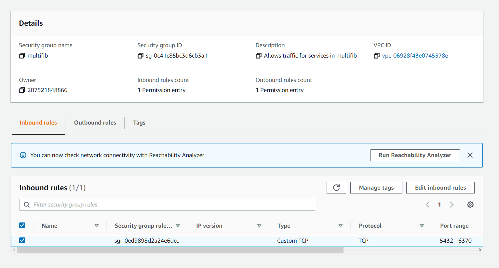

[Strona główna](https://github.com/rafalbalinski/Multifib) |
[Redis](https://github.com/rafalbalinski/Multifib/blob/master/README_REDIS.md) |
[PostgreSQL](https://github.com/rafalbalinski/Multifib/blob/master/README_POSTGRESQL.md) |
[**Grupy bezpieczeństwa**](https://github.com/rafalbalinski/Multifib/blob/master/README_SECURITY_GROUP.md) |
[AWS CLI](https://github.com/rafalbalinski/Multifib/blob/master/README_AWS_CLI.md)

# SECURITY GROUP

## Tworzenie grupy bezpieczeństwa
Aby serwery mogłby się komunikować z bazami **postgreSQL** oraz **Redis**
należy utworzyć grupę bezpieczeństwa w której zdefiniowane zostanie
na jakich portach serwisy mogą się między sobą komunikować  

Następnie utworzoną grupe należy dodać do wszystkich trzech usług

